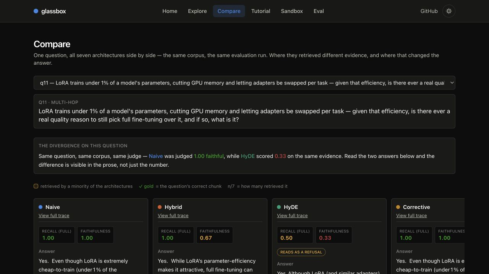

# glassbox

**See inside RAG.** glassbox runs seven real retrieval-augmented generation architectures over one deliberately designed AI/ML corpus, records every intermediate step, and replays those traces in an interactive web atlas.

[Live demo](https://ssavan99.github.io/glassbox/) · [Compare architectures](https://ssavan99.github.io/glassbox/compare?q=q11) · [Evaluation report](https://ssavan99.github.io/glassbox/eval)



The site is static and never exposes an API key or calls an LLM. Its Explore, Compare, Tutorial, and Eval views replay **189 recorded runs**; the Sandbox performs real in-browser embedding and retrieval, while clearly labeling its recorded/extractive LLM-shaped steps.

## What is here

- 60 hand-edited AI/ML engineering notes, chunked into 127 passages, with 43 recurring entities appearing in at least three notes each.
- 27 labeled questions: 10 factual, 7 keyword, 6 multi-hop, and 4 deliberately unanswerable.
- A Python engine with a validated trace-DAG contract, committed index/graph/evaluation artifacts, and a Groq-primary / Ollama-fallback LLM client.
- A Vite + React + TypeScript site on GitHub Pages: Explore, Compare, Eval, seven source-derived tutorials, and an executable pipeline Sandbox.

## Seven architectures

| Architecture | Retrieval / reasoning path | Why it is useful |
|---|---|---|
| Naive | Embed question → dense top-5 → generate | The honest baseline: one similarity search and one answer. |
| Hybrid | Dense + BM25 → reciprocal-rank fusion → cross-encoder rerank → generate | Combines semantic matches with exact-term recall. |
| HyDE | Draft hypothetical answer → embed it → dense retrieval → generate | Tests whether answer-shaped queries retrieve better evidence. |
| Corrective | Retrieve → LLM grade → optionally rewrite and re-retrieve → generate | Makes relevance judgments visible; capped at two corrections. |
| Graph | Seed query entities → two-hop graph expansion → generate | Uses offline-extracted relationships and community summaries. |
| Agentic | Plan ≤3 sub-questions → choose tools → reflect/retry → synthesize | Records the loop, tool choices, and limits rather than hiding them. |
| Adaptive | LLM route → run and splice one of the other six traces | Shows the cost and trade-offs of delegation. |

The [tutorials](https://ssavan99.github.io/glassbox/tutorial/naive) extract each architecture's real `run()` method at build time, so code excerpts cannot drift from the engine.

## What the evaluation found

These are the current values in [`artifacts/eval.json`](artifacts/eval.json), generated from all 189 architecture/question runs. `recall_full` is the fair retrieval measure for Graph and for Agentic/Adaptive rows that used the graph tool; it does not truncate an unranked gathered context to five results.

| Architecture | recall_full | MRR@10 | nDCG@10 | LLM-judged faithfulness |
|---|---:|---:|---:|---:|
| Naive | 0.935 | 0.822 | 0.841 | 0.821 |
| Hybrid | **0.957** | 0.857 | **0.864** | **0.895** |
| HyDE | 0.935 | **0.878** | 0.864 | 0.648 |
| Corrective | 0.935 | 0.801 | 0.826 | 0.648 |
| Graph | 0.326 | — | — | 0.389 |
| Agentic | 0.891 | 0.634† | 0.624† | 0.654 |
| Adaptive | 0.935 | 0.819† | 0.818† | 0.815 |

† Reduced meaning where graph retrieval was involved; Graph's MRR/nDCG are not meaningful at all. See [limitations](#limitations-and-honest-boundaries).

The results are deliberately not a victory lap:

- Hybrid is the strongest overall result here, and on keyword questions its recall_full is 0.929 versus Naive's 0.857; MRR ties at 0.857 and nDCG slightly favors Naive (0.857 vs 0.839), while faithfulness favors Hybrid 1.000 vs 0.857. That is a real but mixed keyword result, not a clean sweep.
- Graph remains materially weak even under the fair metric: 0.326 recall_full and 0.389 faithfulness, both well below every other architecture on this corpus.
- HyDE and Corrective retrieve about as much relevant evidence as Naive but each reaches only 0.648 faithfulness. Retrieval quality is not answer quality.
- Agentic did **not** beat Naive on the six multi-hop questions: 0.750 vs 0.917 recall_full and 0.444 vs 0.778 faithfulness. The q11 trace is the clearest counterexample: correct evidence was present, yet Agentic invented unsupported “behavioral coherence” and “spillover effects.”
- All seven architectures achieved 1.0 refusal correctness on the four unanswerable questions. That saturation comes from a shared grounded-refusal preamble, so it is a corpus/prompt finding—not evidence that Corrective uniquely handles refusal better.

## Architecture

```text
corpus/notes/*.md
        │  load + heading-aware chunking + MiniLM embeddings
        ▼
artifacts/{chunks.json,vectors.f32,bm25.json,graph.json}
        │
        ├── Python architectures ──► validated Trace DAGs ──► eval.json + traces/*.json
        │                                                        │
        └── export_web.py ──────────────────────────────────────┘
                                                                 ▼
                                                   React / GitHub Pages atlas
                                                   Explore · Compare · Tutorial · Eval
                                                   Sandbox: live browser retrieval
```

## Install and run

Prerequisites: Python 3.11+, Node 20+, and [Ollama](https://ollama.com). The committed artifacts make a fresh checkout immediately explorable; rebuilding the graph or the full evaluation is intentionally an offline, LLM-backed operation.

```bash
git clone https://github.com/Ssavan99/glassbox.git
cd glassbox
python3 -m venv .venv
source .venv/bin/activate
python -m pip install --upgrade pip
pip install -e ".[dev]"
ollama pull qwen2.5:7b-instruct
cp .env.example .env
python scripts/build_index.py
python scripts/verify_corpus.py
python -c 'from engine.architectures.naive import NaiveArchitecture; trace = NaiveArchitecture().run("What does RAG add beyond semantic search?"); print(trace.architecture, len(trace.nodes), trace.answer[:120])'
pytest
ruff check .
```

With the copied, empty `.env`, that architecture command runs end-to-end through the local Ollama fallback. To prefer Groq's free tier for offline generation/evaluation, set `GROQ_API_KEY=gsk_...` in `.env`; no other code changes are needed, and any missing/invalid/rate-limited Groq call falls back to Ollama automatically.

Run the web app in a second terminal:

```bash
cd glassbox
source .venv/bin/activate
cd web
npm ci
npm run dev
```

Open the printed local URL with the `/glassbox/` base path. `predev` exports the committed artifacts and regenerates tutorial excerpts before Vite starts.

## Limitations and honest boundaries

- **Corrective is not full CRAG.** Its web-search fallback is intentionally omitted. When retrieval is poor, it rewrites and re-retrieves at most twice; no paid/signup search API is hidden behind the name.
- **The corpus is designed, not scraped.** Its recurring entities, exact-keyword traps, multi-hop splits, and near-miss decoys were planted to expose behaviors. That makes it an instructional benchmark, not a claim about open-web retrieval.
- **One embedding model.** Both Python and browser retrieval use `all-MiniLM-L6-v2` (384 dimensions). Results do not establish that the rankings generalize across embedding models or domains.
- **LLM judging is directional, not ground truth.** Faithfulness and refusal scores come from an LLM judge on the same Groq/Ollama backend family that generated the answers; a model can be biased toward its own phrasing and characteristic errors.
- **Rank metrics have a real scope limit.** recall@5/MRR@10/nDCG@10 presume one relevance-ranked list. Graph orders context by entity degree, so those metrics are unreliable for Graph; they have reduced meaning for Agentic/Adaptive rows that touched the graph tool. Use `recall_full` there. This correction made Graph look less catastrophically truncated, but its 0.326 recall_full still shows substantially weaker real performance.
- **Agentic has a documented groundedness failure.** On q11 it had the correct full-fine-tuning evidence yet produced unsupported terms including “spillover effects.” The project keeps that trace because the point is to inspect failures, not hide them.
- **Keyword and refusal findings are constrained.** Hybrid's keyword gain is marginal/mixed across rank metrics, and refusal correctness is saturated at 1.0 for every architecture because the shared prompt already pushes all of them to refuse honestly.
- **The LLM backend is durable, not immutable.** Offline calls use Groq (`openai/gpt-oss-120b`) first and local `qwen2.5:7b-instruct` through Ollama on any failure. The Groq model identifier already changed once during this build when the original hosted model disappeared; `engine/config.py` is the source of truth.
- **Mobile Sandbox wiring is a rough edge.** Tap-to-add is touch-friendly and the presets let mobile users run real retrieval, but React Flow's small connection handles make touch drag-wiring difficult. It is not presented as polished mobile canvas editing.

## Verification

The repository's CI runs Python lint/tests and web typecheck/build/test steps. The current tracked artifacts are the source of truth for the live demo; `web/public/data/` is regenerated rather than committed. See [`corpus/README.md`](corpus/README.md) for the benchmark design and [`evaluation/metrics.py`](evaluation/metrics.py) for metric definitions.

## License

MIT — see [LICENSE](LICENSE).
